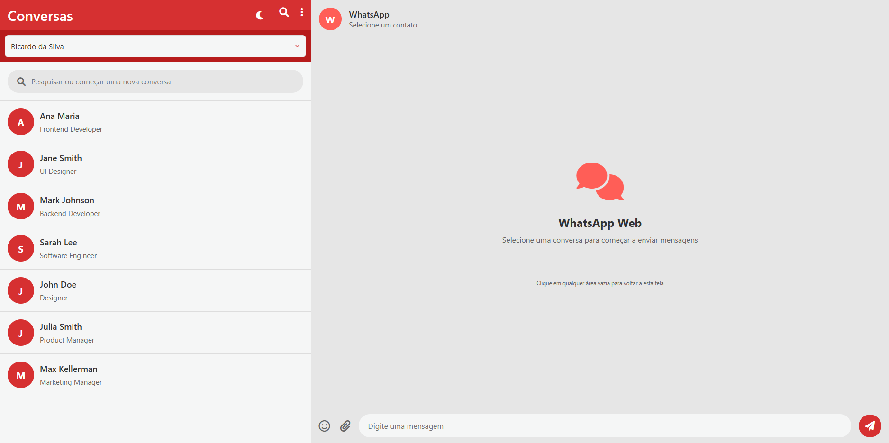
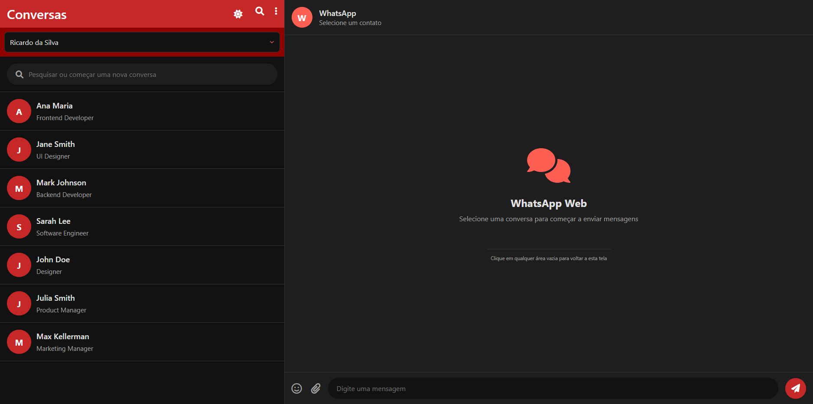

# WhatsApp Clone




## Sobre:
Um clone do WhatsApp Web desenvolvido com HTML, CSS e JavaScript, consumindo uma API REST para simular funcionalidades reais do WhatsApp.

## ✨ Funcionalidades Principais:
- **Interface fiel ao WhatsApp Web** com sidebar de contatos e área de conversa
- **Troca de usuários** através do seletor no cabeçalho
- **Modo claro/escuro** com persistência local
- **Lista de contatos** com últimas mensagens e horários
- **Visualização de conversas** com balões de mensagens
- **Envio de mensagens** (simulado)
- **Busca em mensagens** por palavra-chave
- **Perfil do usuário** com informações pessoais
- **Totalmente responsivo** para mobile e desktop

## 🛠 Tecnologias Utilizadas
- **Frontend:**
  - HTML5 semântico
  - CSS3 com variáveis e media queries
  - JavaScript ES6+
  - Font Awesome para ícones

- **Backend (simulado):**
  - API REST (endpoint local: `http://localhost:3030`)
  - JSON para estrutura de dados

### 🚀 Como Executar o Projeto:
**Clone o repositório**:
```
   git clone https://github.com/seu-usuario/whatsapp-clone.git
```

## 📂 Estrutura do Projeto:
whatsapp-clone/ <br> 
├── index.html          # Arquivo HTML principal <br>
├── styles.css          # Todos os estilos CSS <br>
├── script.js           # Lógica principal da aplicação <br>
└── README.md           # Documentação <br>

## 🎨 Personalização
Você pode customizar o esquema de cores modificando as variáveis CSS no arquivo styles.css:
```
:root {
    --primary-color: #d63031;      /* Cor principal */ 
    --primary-dark: #b71c1c;      /* Tom mais escuro para cabeçalhos */ 
    --primary-light: #ff5e57;     /* Tom mais claro para destaques */ 
    --background: #f5f6f6;        /* Cor de fundo principal */ 
    --chat-background: #e6e6e6;   /* Cor de fundo da área de chat */ 
    --text-primary: #333;         /* Cor primária de texto */ 
    --text-secondary: #666;       /* Cor secundária de texto */ 
}
```

## 📚 Aprendizados:
Este projeto permitiu desenvolver habilidades em:
- Consumo de APIs REST com Fetch API
- Manipulação do DOM com JavaScript puro
- Técnicas modernas de CSS (variáveis, flexbox)
- Princípios de design responsivo
- Armazenamento local de preferências
- Organização de código JavaScript

Durante o curso Técnico em Desenvolvimento de Sistemas do [SENAI Jandira](https://sp.senai.br/unidade/jandira/)

✉️ Contato:
Gabriel Soares

🔗 [LinkedIn - Gabriel Soares](https://www.linkedin.com/in/gabriel-soares-3098782b0/)